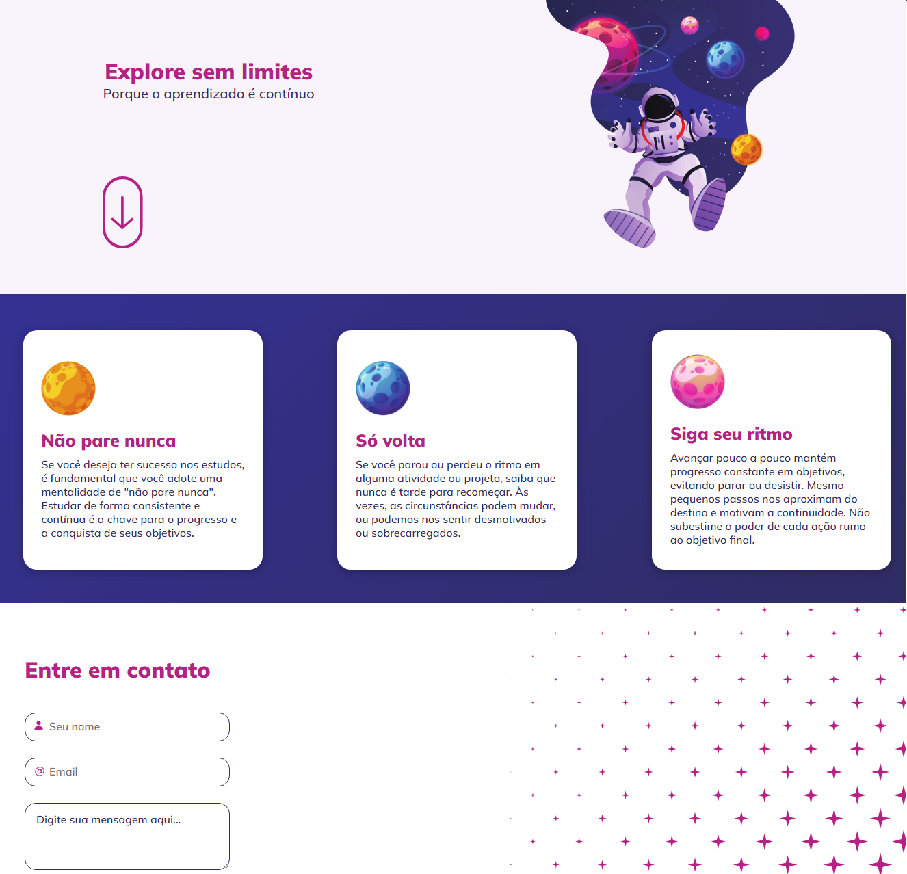

# Desafio Intensivão do curso Explorer da Rocketseat

    
    
    

Este projeto é um desafio para conclusão da primeira etapa do curso Explorer da Rocketset. Ele consiste em um website inspirador que destaca a importância da aprendizagem contínua e da perseverança nos estudos e projetos pessoais.

## :building_construction: Funcionalidades

- Mensagens Inspiradoras: O site apresenta mensagens motivacionais em cartões com imagens de planetas.
- Formulário de Contato: Os usuários podem entrar em contato através de um formulário que inclui campos para nome, e-mail e mensagem.

## :exclamation: Pré-requisitos

Navegador web moderno

## :hammer: Instalação

1. Clone o repositório: git clone https://github.com/Raissa-Cardoso/XR-Desafio-Intensivao.git
2. Abra o arquivo `index.html` em seu navegador web.

## :computer: Uso

1. Visualização: Abra o arquivo `index.html` em seu navegador.
2. Navegação: Explore as diferentes seções do site e leia as mensagens motivacionais.
3. Contato: Utilize o formulário na seção "Entre em contato" para enviar uma mensagem.

## :star: Tecnologias utilizadas

- **`HTML`**
- **`CSS`**
- **`Javascript`**